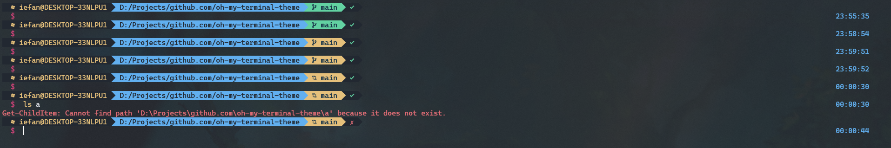
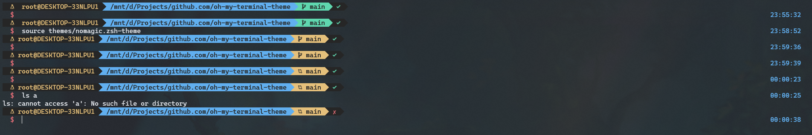

# 🌟 nomagic - A theme powered by [agnoster](https://github.com/agnoster/agnoster-zsh-theme)

- oh-my-posh


- oh-my-zsh


# Installation

- oh-my-posh
  
  1. [Install](https://ohmyposh.dev/docs/installation/) oh-my-posh first.
  2. Run in pwsh: `./install.ps1`


- oh-my-zsh
  
  1. [Install](https://ohmyz.sh/#install) oh-my-zsh first.
  2. Run in zsh: `./install.sh`


 ## Resolve git too slow in WSL

 Append the code to `~/.zshrc`
 
 ```shell
 function git() {
  if $(pwd -P | grep -q "^\/mnt\/.\/*"); then
    git.exe "$@"
  else
    command git "$@"
  fi
}
 ```